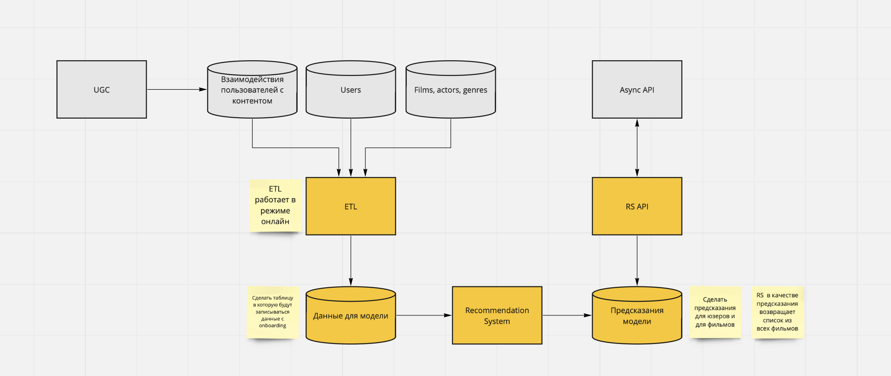

# Проектная работа: диплом

Архитектура сервиса


Запуск dev версии

```
make build-n-run
```

ASYNC API - клиентское апи, для фронта
```
http://0.0.0.0:8000/api/openapi
```

RS API - апи рекоммендательной системы
```
http://0.0.0.0:8888/api/openapi
```

RS - внутреннее апи рекоммендательной системы
```
http://0.0.0.0:8080/rs/docs
```

